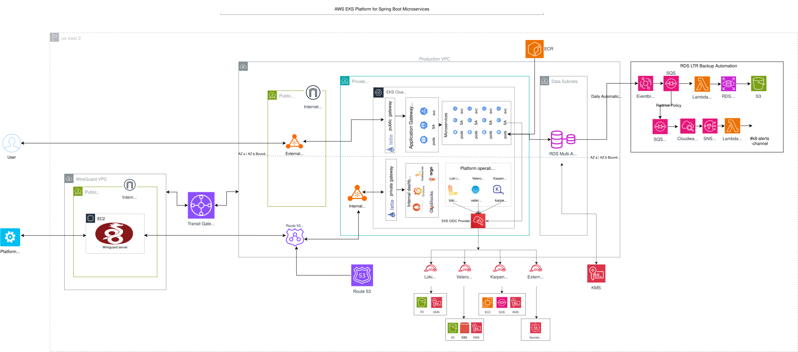
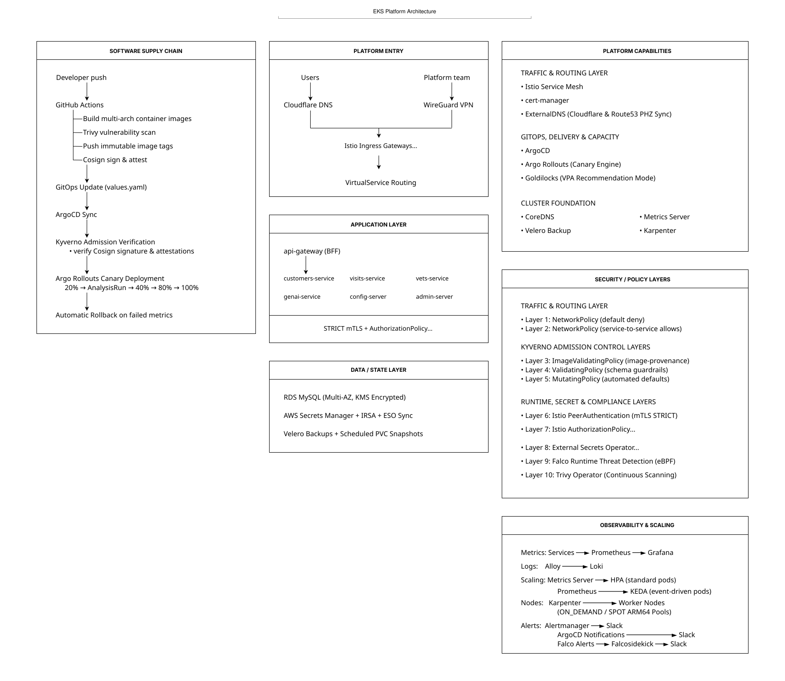
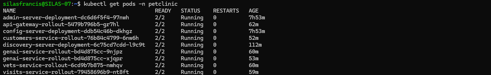
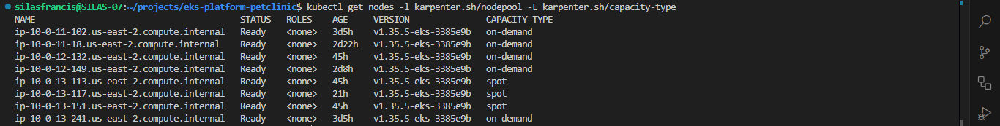
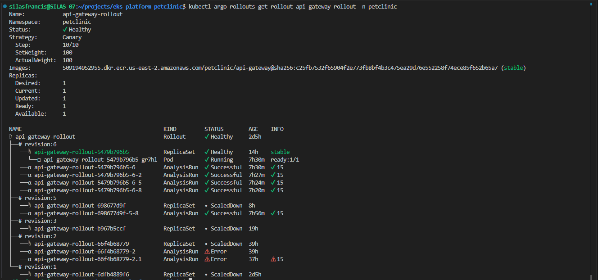

# Architecture

## Overview

A Kubernetes platform on AWS EKS built around the [Spring PetClinic microservices application](https://github.com/spring-petclinic/spring-petclinic-microservices).

<!-- Hero diagrams — visual overview -->

*AWS infrastructure — VPC layout, EKS cluster, Transit Gateway, IRSA, RDS backup automation*


*Platform layers — supply chain, service mesh, security model, observability, GitOps*

---

## How to Read This Document

The platform is described from the infrastructure layer upward:

1. Multi-environment networking
2. Platform access paths
3. Traffic flow inside the cluster
4. Application architecture
5. Scaling model
6. Observability and operations
7. Security enforcement
8. CI/CD and GitOps delivery
9. Secrets and disaster recovery
10. Design decisions

---

## Multi-Environment Setup

Two environments run as independent EKS clusters in separate VPCs.
Each environment runs its own ArgoCD instance and manages only its own
applications. A dedicated WireGuard VPC connects to both environments
through an AWS Transit Gateway.

```
WireGuard VPC — 10.2.0.0/16
┌──────────────────────┐
│  Public subnet       │
│  ├── WireGuard EC2   │
│  └── Elastic IP      │
└──────────┬───────────┘
           │
    ┌──────▼──────┐
    │  Transit    │
    │  Gateway    │
    └──┬──────┬───┘
       │      │
┌──────▼──┐  ┌▼──────────┐
│Dev VPC  │  │Prod VPC   │
│10.1.0.0 │  │10.0.0.0   │
│  /16    │  │  /16      │
│         │  │           │
│Private  │  │Public     │
│subnets: │  │subnets:   │
│EKS nodes│  │Ext. NLB   │
│Int. NLB │  │NAT GW     │
│         │  │           │
│Data:    │  │Private    │
│RDS      │  │subnets:   │
│         │  │EKS nodes  │
│ArgoCD   │  │Int. NLB   │
│(dev)    │  │           │
└─────────┘  │Data:      │
             │RDS        │
             │           │
             │ArgoCD     │
             │(prod)     │
             └───────────┘
```

### Transit Gateway

A single AWS Transit Gateway connects all three VPCs with explicit
routing and environment isolation.

**Isolation model:**

| From | To | Result |
|---|---|---|
| WireGuard | Dev | Allowed |
| WireGuard | Prod | Allowed |
| Dev | WireGuard | Allowed |
| Prod | WireGuard | Allowed |
| Dev | Prod | Blocked (explicit black-hole route) |
| Prod | Dev | Blocked (explicit black-hole route) |

**Traffic flow:**

```
Engineer laptop
    │ WireGuard VPN UDP 51820
    ▼
WireGuard EC2 (WireGuard VPC, public subnet, Elastic IP)
    │
    │ Transit Gateway
    ├──────────────────────► Prod EKS API (prod private subnet)
    │
    └──────────────────────► Dev EKS API (dev private subnet)

Client AllowedIPs = 10.0.0.0/8
```

Each VPC has a dedicated TGW route table:

- **WireGuard route table** — propagates dev and prod routes (can reach both)
- **Dev route table** — propagates WireGuard route only + black-hole for prod
- **Prod route table** — propagates WireGuard route only + black-hole for dev

### ArgoCD Per Environment

Each EKS cluster runs its own ArgoCD instance managing only its own
applications. There is no cross-cluster ArgoCD control.

```
ArgoCD (dev cluster)   → manages dev applications only
ArgoCD (prod cluster)  → manages prod applications only
```

This reduces blast radius — an ArgoCD outage or misconfiguration in
one environment cannot affect the other. Each cluster is fully
self-contained.

---

## HOW USERS AND ENGINEERS ACCESS THE PLATFORM

Two separate entry points — public traffic and internal admin traffic
are handled by completely separate NLBs and Istio Gateways.

```
┌──────────────────────────────────────────┐  ┌────────────────────────────────────────────────────┐
│ PUBLIC TRAFFIC                           │  │ INTERNAL / ADMIN TRAFFIC                           │
│                                          │  │                                                    │
│ Anyone on the internet                   │  │ Engineers only (VPN required)                      │
│            │                             │  │            │                                       │
│            ▼                             │  │            ▼                                       │
│ Cloudflare DNS                           │  │ WireGuard VPN                                      │
│ (public A record → External NLB IP)      │  │ EC2 · dedicated WireGuard VPC                      │
│            │                             │  │ Configured via Ansible over SSM                    │
│            ▼                             │  │ No SSH port open                                   │
│ External NLB (public subnet)             │  │            │                                       │
│ internet-facing · port 443               │  │            ▼                                       │
│            │                             │  │ Transit Gateway routes to                          │
│            ▼                             │  │ prod or dev VPC                                    │
│ Istio PUBLIC Gateway                     │  │            │                                       │
│ TLS terminated · wildcard cert           │  │            ▼                                       │
│ cert-manager · Let's Encrypt DNS-01      │  │ Route53 Private Hosted Zone                        │
│            │                             │  │ Resolves only inside VPC                           │
│            ▼                             │  │            │                                       │
│ petclinic.lefrancis.org                  │  │            ▼                                       │
│ PetClinic application (8 services)       │  │ Internal NLB (private subnet)                      │
│                                          │  │ Not reachable from internet                        │
│                                          │  │            │                                       │
│                                          │  │            ▼                                       │
│                                          │  │ Istio INTERNAL Gateway                             │
│                                          │  │ TLS terminated · same wildcard                     │
│                                          │  │            │                                       │
│                                          │  │            ▼                                       │
│                                          │  │ grafana.internal.lefrancis.org   → Grafana         │
│                                          │  │ argocd.internal.lefrancis.org    → ArgoCD          │
│                                          │  │ prometheus.internal.lefrancis.org → Prom.          │
│                                          │  │ goldilocks.internal.lefrancis.org → Goldilocks     │
└──────────────────────────────────────────┘  └────────────────────────────────────────────────────┘
               │                                                  │
               └────────────────► cert-manager ◄──────────────────┘
                                  Let's Encrypt DNS-01
                                  Cloudflare API token via ESO

DNS automation:
  ExternalDNS (Cloudflare) → public A record  → petclinic.lefrancis.org
  ExternalDNS (Route53)    → private A records → all dashboard hostnames
  Two independent instances, each with its own annotation filter.
```

---

## HOW TRAFFIC ROUTES INSIDE THE CLUSTER

Every pod has an Istio sidecar (Envoy proxy) injected automatically.
All inter-service traffic flows through these proxies — encryption,
traffic splitting, and policy enforcement without application code changes.

```
Request arrives at Istio Gateway
        │
        ▼
VirtualService — routes by path prefix:
  /api/customer/*  →  customers-service
  /api/visit/*     →  visits-service
  /api/vet/*       →  vets-service
  /api/genai/*     →  genai-service
  /*               →  api-gateway (catch-all)

During canary release (Argo Rollouts manages VirtualService weights):
  Normal:  100% → stable pods
  Canary:   80% → stable pods  +  20% → canary pods (new version)
              ↓                        ↓
          stable-svc             canary-svc
       (DestinationRule)      (DestinationRule)

ArgoCD ignoreDifferences on VirtualService weights prevents sync
conflicts while a canary is active.

All pod-to-pod traffic:
  PeerAuthentication: STRICT — mTLS enforced everywhere
  AuthorizationPolicy: cryptographic service account identity,
  not IP-based — only explicitly named accounts may call each service
```

---

## THE APPLICATION

Eight Spring Boot microservices deployed to the `petclinic` namespace.
All share one Helm chart with per-service value overrides.

```
                        ┌─────────────────┐
                        │   api-gateway   │  Rollout · ON_DEMAND · canary
                        └────────┬────────┘
                                 │
          ┌──────────────────────┼──────────────────────┐
          ▼                      ▼                       ▼
  ┌──────────────┐    ┌──────────────────┐    ┌──────────────────┐
  │  customers   │    │     visits       │    │      vets        │
  │  Rollout     │    │     Rollout      │    │      Rollout     │
  │  SPOT · HPA  │    │     SPOT · HPA   │    │      SPOT · HPA  │
  └──────────────┘    └──────────────────┘    └──────────────────┘

  ┌──────────────┐    ┌──────────────────┐    ┌──────────────────┐
  │config-server │    │discovery-server  │    │  admin-server    │
  │ Deployment   │    │  Deployment      │    │  Deployment      │
  │ ON_DEMAND    │    │  ON_DEMAND       │    │  ON_DEMAND       │
  └──────────────┘    └──────────────────┘    └──────────────────┘

  ┌──────────────┐
  │ genai-service│  Rollout · SPOT · KEDA scale-to-zero when idle
  │ Scales to 0  │  Prometheus triggers: HTTP Request Volume
  └──────────────┘
          │
          ▼
  ┌──────────────────┐
  │  RDS MySQL 8.0   │  private subnet · KMS encrypted · Multi-AZ
  │                  │  Flyway migrations run as Helm pre-install hooks
  └──────────────────┘

ESO ExternalSecret pulls credentials from AWS Secrets Manager at pod
startup. No database passwords in Git or Kubernetes manifests.
```

*Petclinic Pods*

---

## HOW NODES AND PODS SCALE

Two levels of scaling — pods (software replicas) and nodes (EC2 VMs).

```
POD SCALING
  HPA                        KEDA                    Goldilocks + VPA
  ──────────────────         ──────────────────      ──────────────────
  Scales Deployments +       Scales genai-service    Watches running pods
  Rollouts on CPU +          to zero when idle.      and recommends right
  memory.                    Scales up on:           CPU/memory requests.
                             HTTP request volume     Advisory only —
  customers · visits ·       Supports Argo           mode: Off.
  vets · api-gateway ·       Rollout via             View in Goldilocks
  admin-server.              enableArgoproj.         dashboard via VPN.
                                    │
                                    ▼
                      Pods need Nodes to run on

NODE SCALING — Karpenter
  Watches pending pods → provisions EC2 in ~30 seconds
  Consolidates underutilised nodes → terminates to reduce cost

  ON_DEMAND NodePool            SPOT NodePool
  ──────────────────────        ──────────────────────────────
  t4g (ARM64/Graviton)          t4g, m6g, m7g, c6g, c7g, r6g, r7g
  weight: 100                   weight: 1
  config-server                 customers, visits, vets, genai
  discovery-server              Toleration: spot=true:NoSchedule
  api-gateway                   SQS queue handles interruptions
  admin-server                  EventBridge → Karpenter drains
                                node before AWS reclaims it

  Bootstrap node group (1× t4g.medium)
  Terraform-managed · Karpenter only
  CriticalAddonsOnly taint — no application workloads
```
---

*Karpenter Provisioned Nodes*

## WHAT PLATFORM ENGINEERS SEE

```
┌──────────────────────┐  ┌──────────────────────┐  ┌────────────────────────┐
│  METRICS             │  │  LOGS                │  │  ALERTS                │
│                      │  │                      │  │                        │
│  Prometheus          │  │  Alloy DaemonSet     │  │  30+ PrometheusRules   │
│  20Gi PVC · 15d      │  │  collects from:      │  │                        │
│                      │  │  petclinic           │  │  Alertmanager:         │
│  Scrapes:            │  │  monitoring          │  │  warning → Slack       │
│  • Spring Boot       │  │  istio-ingress       │  │  critical → Slack      │
│    Actuator          │  │                      │  │            + email     │
│  • Istio Envoy       │  │  Parses JSON         │  │                        │
│  • RDS via CW Exp.   │  │  Extracts level      │  │  Falco → Falcosidekick │
│  • Karpenter         │  │  Ships to Loki       │  │  → #petclinic-security │
│  • Velero            │  │                      │  │                        │
│  • ArgoCD            │  │  S3 backend · 31d    │  │  Velero failures       │
│  • Falco             │  │  LogQL via Grafana   │  │  → critical channel    │
│  • Trivy             │  │  Explore             │  │                        │
└──────────┬───────────┘  └──────────┬───────────┘  └───────────┬────────────┘
           └─────────────────────────┴──────────────────────────-┘
                                     │
                                     ▼
                        ┌────────────────────────┐
                        │   Grafana (VPN only)   │
                        │                        │
                        │  7 dashboards:         │
                        │  • Cluster health      │
                        │  • Namespace/workload  │
                        │  • Per-service deep    │
                        │  • Istio / traffic     │
                        │  • ArgoCD / GitOps     │
                        │  • SLO / error budget  │
                        │  • RDS / database      │
                        └────────────────────────┘
```

---

## HOW THE PLATFORM ENFORCES RULES — 9 SECURITY LAYERS

Every deployment passes through nine independent layers automatically.

```
NETWORK LAYERS (L3/L4)
  Layer 1 — NetworkPolicy: default-deny-all on petclinic namespace
  Layer 2 — NetworkPolicy: explicit per-service allow rules

ADMISSION LAYERS
  Layer 3 — Kyverno ImageValidatingPolicy: Cosign signature verification
             Image must be signed by CI pipeline (keyless · GitHub OIDC)
             Vulnerability attestation must exist for the image

  Layer 4 — Kyverno ValidatingPolicy: pod security schema guardrails
             non-root · read-only root fs · drop ALL caps
             seccompProfile: RuntimeDefault required

  Layer 5 — Kyverno MutatingPolicy: automated security context defaults
             auto-injects missing security context fields

RUNTIME LAYERS
  Layer 6 — Istio PeerAuthentication: mTLS STRICT
             All pod-to-pod traffic encrypted and mutually authenticated
             Rejects any non-mTLS connection

  Layer 7 — Istio AuthorizationPolicy
             L7 RBAC using workload identity, principals, paths, and methods

  Layer 8 — External Secrets Operator: AWS Secrets Manager sync
             No secrets in Git · IRSA authenticates to AWS
             Secrets injected at pod startup only

  Layer 9 — Falco: eBPF runtime threat detection (modern_ebpf driver)
             Monitors syscalls on all nodes including SPOT
             Custom petclinic rules · alerts → Falcosidekick → Slack

  Layer 10 — Trivy Operator: continuous image scanning
             Every 24h · pod creation triggers immediate scan
             EKS CIS 1.4 + NSA hardening + PSS baseline every 6h
             .trivyignore mirrored between CI and Trivy Operator
```

**Supply chain (pre-admission):**
```
git push
  → Trivy scan (gate on CRITICAL)
  → ECR push (immutable tag)
  → Cosign sign (keyless · GitHub OIDC)
  → Cosign attest vulnerability report to ECR
  → Kyverno verifies signature + attestation at admission
  → pod starts

No unsigned or unattested image can run in the cluster.
```

---

## HOW DEPLOYMENTS HAPPEN

```
Branch policy (GitHub Actions):
  feature/* → dev   (PRs only · auto-closed if violated)
  dev       → main  (PRs only · auto-closed if violated)

Developer pushes → PR to dev → CI runs
        │
        ▼  GitHub Actions — matrix build, all 8 services in parallel

  ┌───────────────┐  ┌───────────────┐  ┌───────────────┐  ┌──────────────────┐
  │ Build image   │  │  Trivy scan   │  │  Push to ECR  │  │  Cosign sign +   │
  │ Buildx        │→ │  Gate on      │→ │  Immutable    │→ │  attest vuln     │
  │ ARM64 + AMD64 │  │  CRITICAL     │  │  tag + latest │  │  report to ECR   │
  └───────────────┘  └───────────────┘  └───────────────┘  └──────────────────┘
        │
        ▼  values file updated with new image tag → commit to Git

ArgoCD polls Git every 2 minutes → detects image tag change
        │
        ▼  Kyverno admission: verify signature + attestation
        │
        ▼  Argo Rollouts canary:

  setWeight: 20%  →  pause 60s  →  AnalysisRun
    • success rate ≥ 99%
    • P99 latency ≤ 2s
    • error count ≤ 10

  setWeight: 40%  →  pause 60s  →  AnalysisRun

  setWeight: 80%  →  pause 60s  →  AnalysisRun

  setWeight: 100%  →  promote

  Any analysis failure → automatic rollback → stable restored

ArgoCD notifications → Slack #petclinic-gitops
  on-deployed · on-health-degraded · on-sync-failed
```

*API Gateway ArgoCD Rollout*
---

## SECRETS AND BACKUP

```
┌──────────────────────────────────────────┐  ┌──────────────────────────────────┐
│  SECRETS                                 │  │  BACKUP (Velero)                 │
│                                          │  │                                  │
│  No secrets in Git.                      │  │  Daily full cluster backup       │
│                                          │  │  30-day retention → S3           │
│  AWS Secrets Manager:                    │  │                                  │
│    prod/argocd           SSH deploy key  │  │  Hourly petclinic namespace      │
│    prod/petclinic         DB credentials │  │  7-day retention → S3            │
│    prod/platform-monitoring  Slack/email │  │                                  │
│    prod/platform-dns     Cloudflare token│  │  Daily monitoring namespace      │
│                                          │  │  Prometheus TSDB · Grafana PVC   │
│  IRSA: each component has its own IAM    │  │                                  │
│  role bound to its service account via   │  │  EBS snapshots for PVC data      │
│  EKS OIDC provider. No static creds.     │  │                                  │
│                                          │  │  node-agent DaemonSet tolerates  │
│  ESO SecretStore syncs secrets           │  │  SPOT — all nodes covered        │
│  into Kubernetes at pod startup.         │  │                                  │
└──────────────────────────────────────────┘  └──────────────────────────────────┘
```

**RDS Automated Backup:**
```
EventBridge (daily schedule)
    → Lambda (triggers RDS snapshot export)
    → RDS snapshot exported to S3 (KMS encrypted)
    → Lambda (Slack notification on failure)

Prod only — disabled in dev via count = local.is_prod ? 1 : 0
```

---

## DESIGN DECISIONS

- **Karpenter over Cluster Autoscaler**
  - Direct EC2 provisioning via RunInstances — 30s node ready time versus 3-5 minutes for Cluster Autoscaler.
  - Automatic consolidation reduces cost without manual intervention.
  - No predefined node groups required.

- **Istio for traffic management**
  - Native Argo Rollouts integration via VirtualService weight management.
  - mTLS STRICT enforces encrypted communication without application changes.
  - Precise canary splitting regardless of replica count — 20% traffic does not require 20% of pods to be canary.

- **Transit Gateway over VPC Peering**
  - Three VPCs require a hub-and-spoke routing model.
  - Transit Gateway provides transitive routing from a single attachment point.
  - WireGuard can reach both dev and prod without direct peering between every VPC pair.
  - TGW route tables enforce dev ↔ prod isolation with explicit black-hole routes.
  - Adding further environments or shared services VPCs requires only a new TGW attachment and route table entry.

- **Dedicated WireGuard VPC**
  - WireGuard runs in its own VPC with no workloads.
  - This isolates the VPN entry point from both application environments.
  - Limits the blast radius of a compromise.
  - Keeps the networking model clean — the WireGuard VPC attaches to TGW the same way as every other VPC.

- **Separate ArgoCD per environment**
  - Each EKS cluster runs its own ArgoCD instance managing only its own applications.
  - An outage or misconfiguration in one environment cannot affect the other.
  - Each cluster is fully self-contained.
  - The tradeoff is two ArgoCD instances to maintain, which at this scale is the correct tradeoff.

- **Loki over Elasticsearch**
  - S3 backend eliminates large PVCs and index management.
  - Sufficient for structured log analysis at this scale.
  - No JVM heap tuning or shard management overhead.

- **ESO over Sealed Secrets**
  - Secrets never exist in Git in any form.
  - AWS Secrets Manager provides rotation support, audit logging, and IAM-based access control.
  - IRSA eliminates static credentials from the cluster entirely.

- **Policy-as-data**
  - Both NetworkPolicy and ArgoCD Applications use a map-based values structure.
  - Adding a service or application requires a values change only — no template modifications.
  - Mirrors how mature platform teams manage policy at scale.