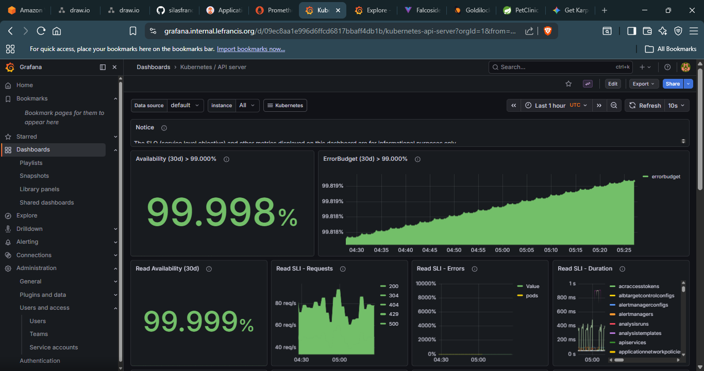
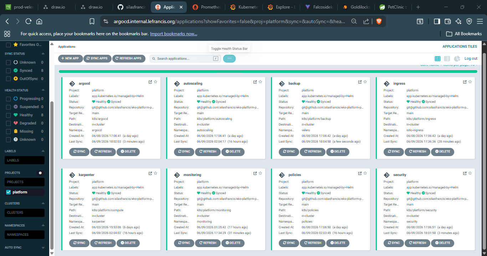

# Testing

Validation procedures to run after deployment or major platform changes.

> [!NOTE]
> The platform may not always be running continuously due to AWS costs.
> If endpoints are unreachable, reprovision infrastructure and follow
> the deployment steps in the README and RUNBOOK.

Run test suites in order — later validation steps assume earlier
platform components are healthy.

---

## Table of Contents

- [Infrastructure](#1-infrastructure)
- [Platform Health](#2-platform-health)
- [Application Health](#3-application-health)
- [External Access](#4-external-access)
- [VPN and Internal Access](#5-vpn-and-internal-access)
- [mTLS Verification](#6-mtls-verification)
- [Network Policy](#7-network-policy)
- [Supply Chain Security](#8-supply-chain-security)
- [Canary Deployment](#9-canary-deployment)
- [Observability](#10-observability)
- [Backup](#11-backup)
- [KEDA Scale to Zero](#12-keda-scale-to-zero)

---

## 1. Infrastructure

```bash
# All nodes ready
kubectl get nodes
# Expected: STATUS=Ready for all nodes

# Karpenter controller healthy
kubectl get pods -n karpenter

# Bootstrap node exists
kubectl get nodes -l node-type=karpenter-bootstrap
```

*Karpenter Provisioned Nodes*

---

## 2. Platform Health

VPN access required for ArgoCD. Each environment has its own ArgoCD
instance — ensure the CLI is authenticated to the correct cluster.

```bash
# All ArgoCD applications healthy
argocd app list
# Expected: Sync=Synced, Health=Healthy for all apps

# Platform namespaces healthy
kubectl get pods -n karpenter
kubectl get pods -n monitoring
kubectl get pods -n security
kubectl get pods -n autoscaling
kubectl get pods -n velero
kubectl get pods -n istio-ingress
kubectl get pods -n kyverno
```

Optional validation:

```bash
# Render and validate all Helm charts
task validate ENV=dev
```

---

## 3. Application Health

```bash
# All petclinic pods running
kubectl get pods -n petclinic
# Expected: Running, all containers Ready

# Eureka registrations visible
kubectl logs -n petclinic \
  -l app=discovery-server \
  --tail=50 | grep "Registered instance"

# Config server responding
kubectl run -it --rm config-test \
  --image=curlimages/curl \
  --restart=Never \
  -n petclinic \
  -- curl http://config-server-svc:8888/actuator/health
# Expected: {"status":"UP"}
```

*Petclinic Pods*

---

## 4. External Access

```bash
# Public application reachable
curl -I https://petclinic.lefrancis.org
# Expected: HTTP 200

# TLS certificate valid
curl -v https://petclinic.lefrancis.org 2>&1 | grep "SSL certificate verify"
# Expected: SSL certificate verify ok

# Internal dashboards must not resolve publicly
curl --max-time 5 https://grafana.lefrancis.org
# Expected: timeout or NXDOMAIN
```

---

## 5. VPN and Internal Access

```bash
# Connect VPN
wg-quick up wg0

# DNS resolves to private IP
nslookup grafana.internal.lefrancis.org
# Expected: private IP — not a public IP

# Internal dashboards reachable
curl -I https://grafana.internal.lefrancis.org
curl -I https://argocd.internal.lefrancis.org
# Expected: HTTP 200 or 302

# Prod cluster API reachable via Transit Gateway
kubectl --context <prod-context> get nodes
# Expected: prod cluster nodes listed

# Dev cluster API reachable via Transit Gateway
kubectl --context <dev-context> get nodes
# Expected: dev cluster nodes listed
```

*Grafana*


*ArgoCD Platform apps*

---

## 6. mTLS Verification

```bash
# Verify mTLS on a service
istioctl authn tls-check \
  customers-service-svc.petclinic.svc.cluster.local
# Expected: STATUS=OK, CLIENT=mTLS, SERVER=mTLS

# Verify STRICT mode is applied
kubectl get peerauthentication -n petclinic
```

---

## 7. Network Policy

```bash
# Default deny policy exists
kubectl get networkpolicy default-deny-all -n petclinic

# Allowed path: petclinic → config-server
kubectl run -it --rm nettest \
  --image=curlimages/curl \
  --restart=Never \
  -n petclinic \
  -- curl http://config-server-svc:8888/actuator/health
# Expected: HTTP 200

# Blocked path: petclinic → visits-service (no direct allow)
kubectl run -it --rm nettest \
  --image=curlimages/curl \
  --restart=Never \
  -n petclinic \
  -- curl --max-time 5 http://visits-service-svc:8082/actuator/health
# Expected: timeout
```

---

## 8. Supply Chain Security

```bash
# Unsigned image must be rejected by Kyverno
kubectl run unsigned-test \
  --image=nginx:latest \
  -n petclinic \
  --restart=Never
# Expected: admission rejected by Kyverno

# Signed image from ECR must be admitted
kubectl run signed-test \
  --image=<account>.dkr.ecr.us-east-2.amazonaws.com/petclinic/api-gateway:<tag> \
  -n petclinic \
  --restart=Never
# Expected: pod created

# Verify vulnerability attestation on a signed image
cosign verify-attestation \
  --type vuln \
  --certificate-identity-regexp "github.com/silasfrancis" \
  --certificate-oidc-issuer https://token.actions.githubusercontent.com \
  <account>.dkr.ecr.us-east-2.amazonaws.com/petclinic/customers-service:<tag>
# Expected: attestation verified, vuln report printed
```

---

## 9. Canary Deployment

```bash
# Trigger a rollout with a new image tag
kubectl argo rollouts set image customers-service \
  customers-service=<account>.dkr.ecr.us-east-2.amazonaws.com/petclinic/customers-service:<new-tag> \
  -n petclinic

# Watch canary progression
kubectl argo rollouts get rollout customers-service \
  -n petclinic \
  --watch
# Expected: progresses through 20% → 50% → 100%

# Verify AnalysisRuns are created and passing
kubectl get analysisrun -n petclinic

# Manually promote if needed
kubectl argo rollouts promote customers-service -n petclinic
```

*API Gateway ArgoCD Rollout*


Grafana verification (VPN required):

```txt
https://grafana.lefrancis.org → Istio dashboard

- Traffic split reflects canary percentage
- Stable and canary versions visible
- Request success rate remains above 99%
```

---

## 10. Observability

```bash
# Prometheus returning metrics for petclinic workloads
kubectl run -it --rm prom-test \
  --image=curlimages/curl \
  --restart=Never \
  -n petclinic \
  -- curl "http://monitoring-prometheus.monitoring:9090/api/v1/query?query=up{namespace='petclinic'}"
# Expected: up=1 for all workloads
```


Loki validation (VPN required, Grafana Explore):

```logql
{namespace="petclinic"} | json
```

Expected:
- recent application log entries visible
- JSON fields parsed correctly
- labels attached to workload logs

---

## 11. Backup

```bash
# Trigger a smoke test backup
velero backup create smoke-test \
  --include-namespaces petclinic \
  --wait

# Verify backup completed
velero backup describe smoke-test
# Expected: Phase=Completed

# Clean up
velero backup delete smoke-test
```

---

## 12. KEDA Scale to Zero

```bash
# Verify genai-service has scaled to zero
kubectl get pods -n petclinic -l app=genai-service
# Expected: 0 pods after cooldown period

# Trigger a request to cause scale-up
curl https://petclinic.lefrancis.org/api/genai/health

# Watch scale-up
kubectl get pods -n petclinic \
  -l app=genai-service \
  --watch
# Expected: pod created within polling interval
```
